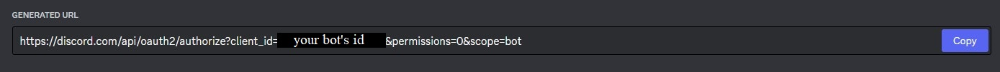

# Discord Attendance Bot

[](https://www.python.org/)
[](https://github.com/Rapptz/discord.py)
[](https://github.com/psf/black)
[](https://conventionalcommits.org)

A simple Discord bot for taking and reporting attendance of users within a specific voice channel.

Originally created for [Boring Security DAO](https://twitter.com/BoringSecDAO).

## Requirements

1. Git - [Install Git](https://git-scm.com/book/en/v2/Getting-Started-Installing-Git)
   1. Check if you have Git installed with `git --version`
2. Python (>=3.10.12) - [Install Python (Windows)](https://www.python.org/downloads/windows/), [Install Python (Linux)](https://docs.python.org/3/using/unix.html)
   1. Check if you have Python installed with `python3 --version`
3. Pip - [Install Pip](https://pip.pypa.io/en/stable/installation/)
   1. Check if you have Pip installed with `pip --version`

## Usage

### Creating a Discord Bot (App)

#### Creating an application

This repo assumes you understand how to create an application through the [Discord Dev Portal](https://discord.com/developers/applications) and attach a bot to it.
**It is recommended to set the bot to private** (public bot: off), as the bot is designed to be self-hosted and only interact with a single guild (server).

<details>
<summary>Disable Public Bot</summary>


</details>

#### Invite the bot

The bot requires no intents or specific permissions when inviting it.
If the voice channel(s) you intend to use with the bot require a specific role or are otherwise restricted in some way, you need to grant an explicit `View Channel` permission to the bot for that voice channel.
Otherwise, the bot is able to view all voice channels the `@everyone` role can view.
To generate a bot invite link, go to your bot's application page in the [Discord Dev Portal](https://discord.com/developers/applications), then navigate to `OAuth2` -> `URL Generator`.
Select the `Bot` scope; no bot permissions are required.

<details>
<summary>Invite Link Example</summary>



</details>

### Installing

#### Clone this repo

```bash
git clone https://github.com/vile/discord-attendance-bot.git
cd discord-attendance-bot
```

#### Rename example .env file

```bash
mv .env.example .env
```

Put your bot's token in .env as `DISCORD_BOT_TOKEN`.

#### Create venv

```bash
make venv
```

#### Install dependencies

```bash
make deps
```

#### Start the bot

```bash
make start
```

## Commands

### Attendance

| Command | Description                                                  | Usage                         |
| ------- | ------------------------------------------------------------ | ----------------------------- |
| start   | Start an attendance session                                  | /attendance start \[channel\] |
| stop    | Stop the active attendance session                           | /attendance stop              |
| get     | Get an attendance report for the last active session         | /attendance get               |
| clear   | Permanently delete all activity from the last active session | /attendance clear             |

### Instructor

| Command | Description                                                 | Usage                         |
| ------- | ----------------------------------------------------------- | ----------------------------- |
| add     | Add a user to the instructor whitelist                      | /instructor add \[member\]    |
| remove  | Remove an existing instructor from the instructor whitelist | /instructor remove \[member\] |
| show    | Show the current list of users on the instructor whitelist  | /instructor show              |

### Settings

| Command        | Description                                  | Usage                               |
| -------------- | -------------------------------------------- | ----------------------------------- |
| get-attendance | Get the current minimum attendance rate      | /settings get-attendance            |
| set-attendance | Set the minimum attendance rate (percentage) | /settings set-attendance \[rate\]   |
| get-interval   | Get the current snapshot interval            | /settings get-interval              |
| set-interval   | Set the snapshot interval (seconds)          | /settings set-interval \[interval\] |

## Known Limitations

Since this bot is developed using [Python's shelve module](https://docs.python.org/3/library/shelve.html) for persistent data storage, there are some limitations intentionally imposed. 
Specifically, the retention of attendance session data (snapshots).
Snapshot data is permanently cleared when using the `/attendance clear` command, as well as on bot restart.
As such, instructors using this bot should immediately export an attendance report using the `/attendance get` command.

