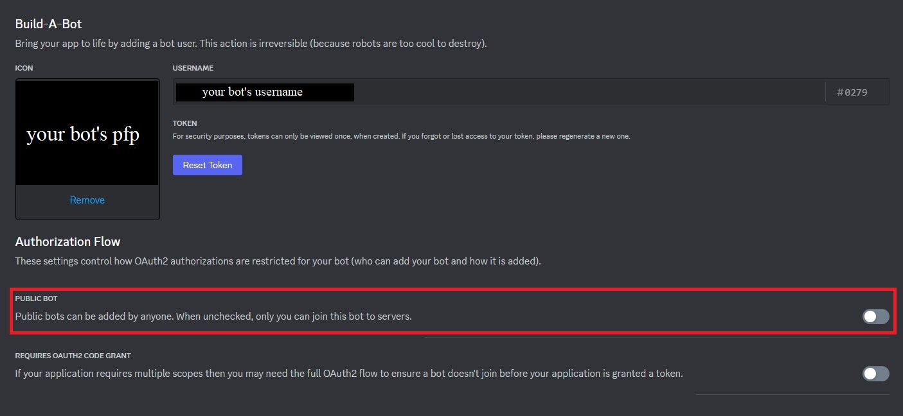
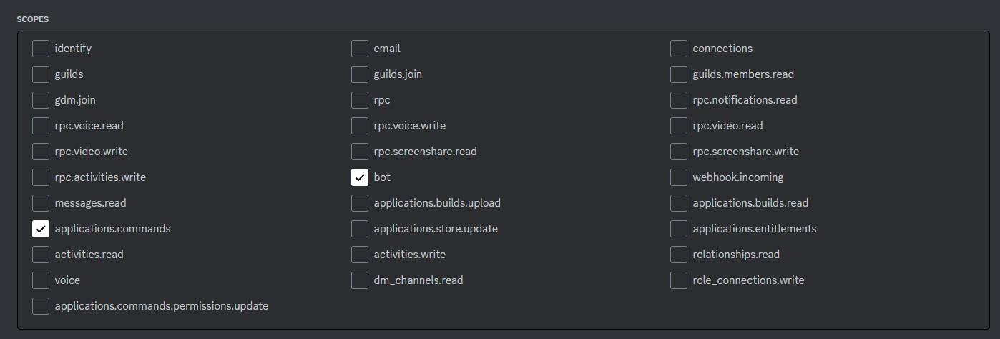
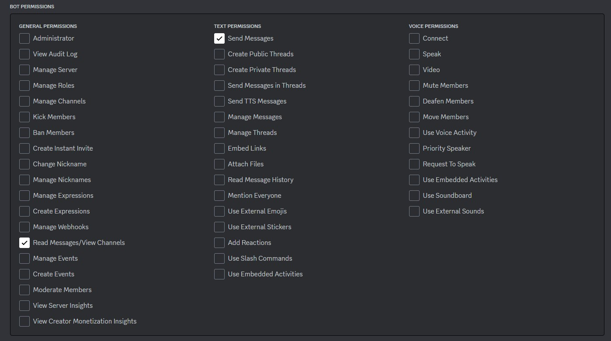
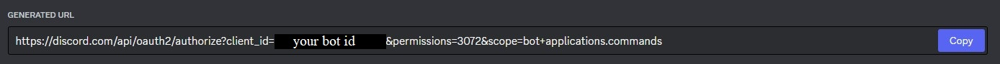
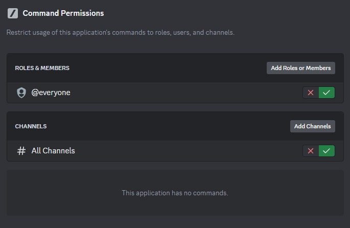
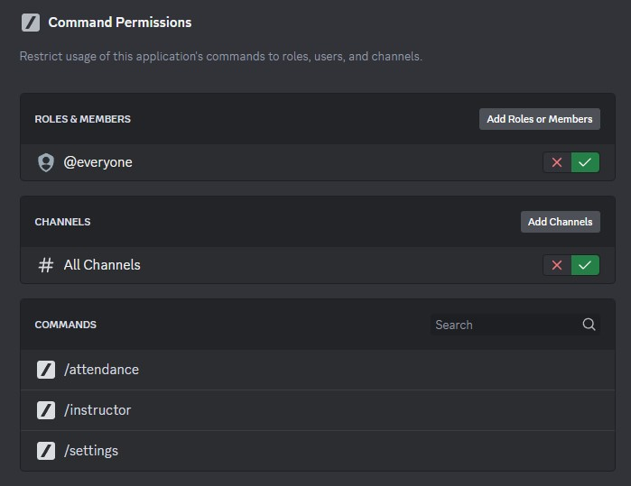

# Discord Attendance Bot

[](https://www.python.org/)
[](https://github.com/Rapptz/discord.py)
[](https://github.com/psf/black)
[](https://conventionalcommits.org)

A simple Discord bot for taking and reporting attendance of users within a specific voice channel.

Originally created for [Boring Security DAO](https://twitter.com/BoringSecDAO).

## Requirements

1. Git - [Install Git](https://git-scm.com/book/en/v2/Getting-Started-Installing-Git)
   1. Check if you have Git installed with `git --version`
2. Python (>=3.10) - [Install Python (Windows)](https://www.python.org/downloads/windows/), [Install Python (Linux)](https://docs.python.org/3/using/unix.html)
   1. Check if you have Python installed with `python3 --version`
3. Pip - [Install Pip](https://pip.pypa.io/en/stable/installation/)
   1. Check if you have Pip installed with `pip --version`

## Usage

### Creating a Discord Bot (App)

#### Creating an application

This repo assumes you understand how to create an application through the [Discord Dev Portal](https://discord.com/developers/applications) and attach a bot to it.
**It is recommended to set the bot to private** (public bot: off), as the bot is designed to be self-hosted and only interact with a single guild (server).

<details>
<summary>Disable Public Bot</summary>
<br>



</details>

#### Invite the bot

The bot requires no intents or specific permissions when inviting it; `Send Messages` is only temporarily required during bot setup.
If the voice channel(s) you intend to use with the bot require a specific role or are otherwise restricted in some way, you need to grant an explicit `View Channel` permission to the bot for that voice channel.
Otherwise, the bot is able to view all voice channels the `@everyone` role can view.
To generate a bot invite link, go to your bot's application page in the [Discord Dev Portal](https://discord.com/developers/applications), then navigate to `OAuth2` -> `URL Generator`.
Select the `bot` and `applications.commands` scopes; no permissions are **required** (see suggested permissions below).

<details>
<summary>Required Scopes</summary>
<br>



</details>

<details>
<summary>Suggested Permissions</summary>
<br>



</details>

<details>
<summary>Invite Link Example</summary>
<br>



- `https://discord.com/api/oauth2/authorize?client_id=YOUR_BOT_ID&permissions=3072&scope=bot+applications.commands`

</details>

### Installing

#### Clone this repo

```bash
git clone https://github.com/vile/discord-attendance-bot.git
cd discord-attendance-bot
```

#### Rename example .env file

```bash
mv .env.example .env
```

Put your bot's token in .env as `DISCORD_BOT_TOKEN`.
Put your guild's ID in .env as `GUILD_ID`.

#### Create venv

```bash
make venv
```

#### Install dependencies

```bash
make deps
```

#### Start the bot

```bash
make start
```

#### Sync Commands to Guild

To make application commands available in the server, mention the bot to invoke the `sync` text command.
Where `~` syncs all guild commands to the current guild (see: [command body](https://about.abstractumbra.dev/discord.py/2023/01/29/sync-command-example.html#command-body), [archive](https://archive.ph/vsSFz)).
Make sure the bot, temporarily, has `Send Messages` in the channel where you are mentioning the bot.

```
<@BOT_USER_ID> sync ~
```

If application commands are not synced to the guild, the bot integration will show that "this application has no commands," (rendering all commands unusable) and autocomplete will not work.

<details>
<summary>This application has no commands</summary>
<br>



</details>

After the command tree has been synced, the bot no longer requires the `Send Messages` permission.

<details>
<summary>Properly synced commands</summary>
<br>



</details>

## Known Limitations

Since this bot is developed using [Python's shelve module](https://docs.python.org/3/library/shelve.html) for persistent data storage, there are some limitations intentionally imposed. 
Specifically, the retention of attendance session data (snapshots).
Snapshot data is permanently cleared when using the `/attendance clear` command, as well as on each bot start.
As such, instructors using this bot should immediately export an attendance report using the `/attendance get` command.

## Acknowledgements

- The [discord.py Discord](https://discord.com/invite/r3sSKJJ) and mod team for my answering questions
- [AbstractUmbra's](https://github.com/AbstractUmbra) open source command tree [syncing command](https://about.abstractumbra.dev/discord.py/2023/01/29/sync-command-example.html) ([The Unlicense](https://unlicense.org/))